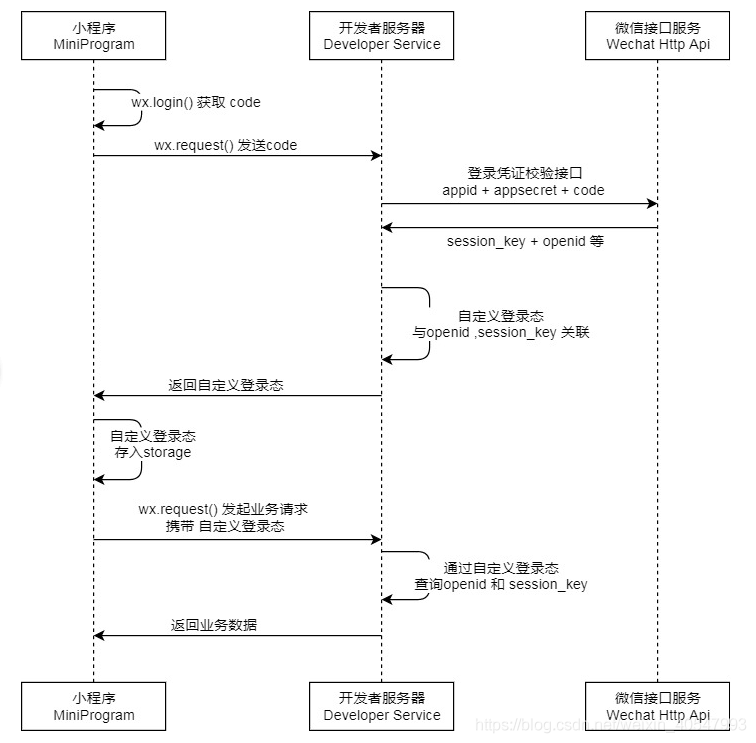

### 微信小程序登录
1、调用 wx.login()接口获取临时登录凭证code（用户登录凭证，有效期5分钟，code 只能使用一次，使用一次后失效）。

2、服务端拿到code，调用 auth.code2Session接口，获取用户唯一标识openId 、用户在开放平台的唯一标识符unionid，会话密钥 session_key。

其中，会话密钥 session_key 是对用户数据进行 加密签名 的密钥。为了应用自身的数据安全，开发者服务器不应该把会话密钥下发到小程序，也不应该对外提供这个密钥。

3、通过openId和session_key可以自定义服务端，判断用户登录状态。

 

### 微信支付 API v3 Python SDK
> https://github.com/minibear2021/wechatpayv3

### 参考地址
[python实现小程序登录及获取用户信息和手机号](https://blog.csdn.net/weixin_40547993/article/details/106904303)

[微信SDK<提供微信登录，公众号管理，微信支付，微信消息的全套功能>](https://github.com/zwczou/weixin-python)

[Python Flask微信小程序登录详解及登录api实现](https://blog.csdn.net/qq_33966519/article/details/106545820#:~:text=Python%20Flask%E5%BE%AE%E4%BF%A1%E5%B0%8F%E7%A8%8B%E5%BA%8F%E7%99%BB%E5%BD%95%E8%AF%A6%E8%A7%A3%E5%8F%8A%E7%99%BB%E5%BD%95api%E5%AE%9E%E7%8E%B0%201%201%E3%80%81%E5%B0%8F%E7%A8%8B%E5%BA%8F%E7%AB%AF%E8%B0%83%E7%94%A8wx.login%202,2%E3%80%81%E5%88%A4%E6%96%AD%E7%94%A8%E6%88%B7%E6%98%AF%E5%90%A6%E6%8E%88%E6%9D%83%203%203%E3%80%81%E5%B0%8F%E7%A8%8B%E5%BA%8F%E7%AB%AF%E8%AE%BF%E9%97%AE%20wx.getUserInfo%204%204%E3%80%81%E5%B0%8F%E7%A8%8B%E5%BA%8F%E7%AB%AFjs%E4%BB%A3%E7%A0%81%EF%BC%9A)
